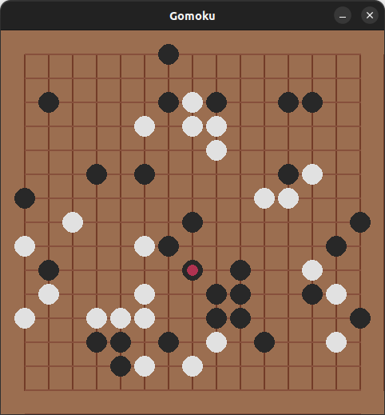

# TP1 - Go-moku
## [Ver Consigna](TP1-Go-moku.md)

## Installing
```bash
# 1-
#Fork the repo into your account
# 2-
git clone https://github.com/YOUR_ACCOUNT/FIA-TP1.git
# 3-
cd TP1/gomoku_udesa
# 4-
pip install -e .
```

## Usage
Copy the example script in the `/scripts` folder import your agent inside and run it.
```bash
python3 scripts/tournament.py
```

## Bugs and Issues
Please report any bugs or issues with the engine.
PRs to add tests or fix bugs are welcome.


## Board


